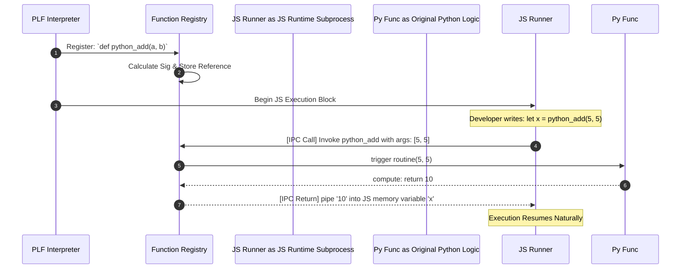
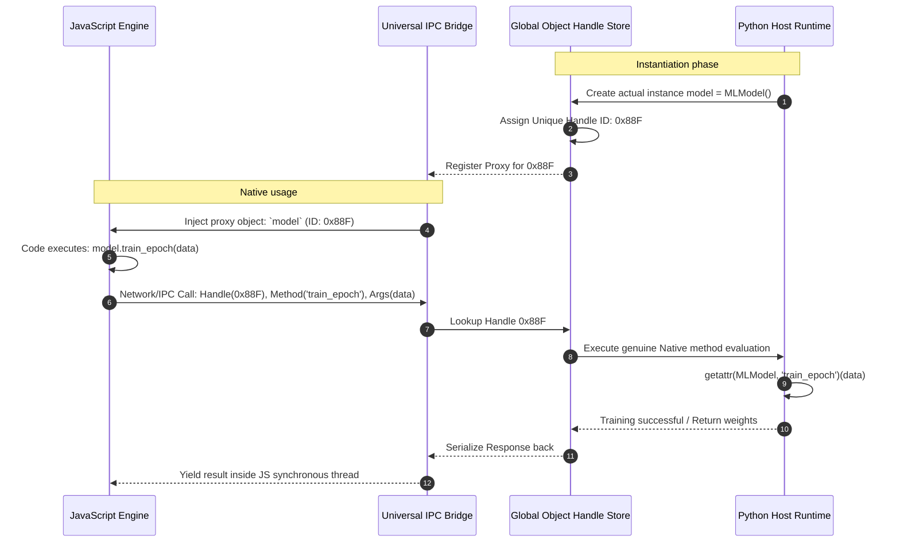

# PLF-Tool: Deep Architectural Design

This document details the exact engineering behind the Poly Language Framework (PLF). Inside PLF, developers write logic in single `.poly` files that transcend traditional runtime boundaries. 

Below are the architectural breakdowns and diagrams for each core feature that makes this massive feat of interoperability possible.

---

## 1. Syntax Parsing Pipeline (Lexer & AST)
The foundation of PLF is avoiding overly complex language-specific grammars. Instead of trying to parse Python natively and C++ natively within the same lexer, PLF breaks down code strictly by isolated "Blocks" during an initial fast-pass.

* **Explanation:** The Lexer chops up the raw `.poly` string, searching exclusively for block headers (`python {`, `java {`). The Parser converts these tokens into Abstract Syntax Tree (AST) nodes, holding the raw language code securely. These nodes are placed in a queue for the Interpreter.

```mermaid
graph TD
    A[Source File 'script.poly'] -->|Reads stream| B(Lexer / Tokenizer)
    B -->|Identifies structure| C{Block Parser}
    
    C -->|Registers 'global {'| D[Global Definition Node]
    C -->|Registers 'python {'| E[Python Execution Node]
    C -->|Registers 'java {'| F[Java Execution Node]
    
    D --> G(Interpreter Processing Queue)
    E --> G
    F --> G
```

---

## 2. Shared Memory Bridging (Context Engine)
Instead of microservices sending HTTP requests, all language runners operate on the same physical computing space governed by the single **Context Engine**. This engine acts as the universal state machine.

* **Explanation:** When Python runs, it exports its variables to the Context Engine. When JavaScript runs moments later, the machinery injects those contextual variables seamlessly as native JS declarations (`var dataset = ...`). This effectively "shares memory" perfectly across isolated subprocess execution bounds without serialization overhead.

```mermaid
graph LR
    A[Python Runner] -->|export('matrix', [[1,2]])| B((Context Engine Data Store))
    
    C[JavaScript Runner] -->|Boots up, requests context| B
    B -->|Translates to: let matrix = [[1,2]];| C
    
    D[C++ Runner] -->|Boots up, requests context| B
    B -->|Writes '#include <vector>' and native vector mapping| D
```

---

## 3. Global Schema Generation (Class Registry)
The Class Registry creates the sensation of true Universal OOP development. A class defined in a `global` space is extrapolated natively to all ecosystems.

* **Explanation:** Before any code executes, the Class Registry extracts the properties inside an abstract `class`. It then performs complex string manipulations to render native boilerplate code for every supported language. The developer defines a schema ONCE, but it is available natively everywhere.

```mermaid
graph TD
    A[Global PLF Definition: class Profile { string name; int age }] -->|Analyzed by| B(Core Class Registry Engine)
    
    B -->|Auto-Generates| C[Python Code: class Profile: def __init__...]
    B -->|Auto-Generates| D[JavaScript Code: class Profile { constructor()... }]
    B -->|Auto-Generates| E[Java Code: public class Profile { ... }]
    B -->|Auto-Generates| F[C++ Code: struct Profile { std::string name; ... }]
```

---

## 4. Cross-Language Function Calls (Function Registry)
A core feature of PLF is treating functions ubiquitously. 

* **Explanation:** When a function is written in the global block, the system calculates its signature (parameters required). It then drops a "Callable Stub" in all other languages. When JS calls a Python function, it invokes this stub. The stub halts the runner, communicates with the Context Engine, runs the original Python logic, and pipes the return value directly back down the chain.



---

## 5. Handle-Based Method Proxying (JNI / IPC Bridge)
Perhaps PLF's most powerful feature is letting remote languages directly modify, mutate, and read from instantiated objects residing inside a completely different runtime (like Python).

* **Explanation:** An object instantiated in Python cannot physically exist inside JavaScript. So, when Python stores `my_car = Car()`, PLF assigns it a UUID (Handle). PLF then builds an empty "Proxy Object" in JS carrying that exact UUID. If JS calls `my_car.drive()`, JS routes an IPC message with the UUID over the Universal Bridge, telling Python to run its own `.drive()` method on the corresponding original instance.



---

## 6. Smart Marshalling Engine (Data Serialization)
Type boundaries are incredibly rigid. Python `dicts` don't translate natively to C++ Memory logic. The Marshalling Engine works as a universal translator.

* **Explanation:** When objects enter the Context Engine, the Marshalling Engine traverses deep data structures iteratively. If it encounters a Python List holding a Dictionary of Strings natively, it renders it mathematically. For NodeJS, it serializes natively via `JSON.stringify`. For C++, it recursively builds C++ `std::map<std::string, std::variant...>` code that compiles safely behind the scenes.

```mermaid
graph TD
    A[Data Dumped to Context <br> Python `[1, "hello", {"key": "value"}]`] --> B(Marshalling Type Iterator)
    
    B --> C{Discover Underlying Type Trees}
    C -->|Detects Array| D[Translate List Container]
    C -->|Detects String| E[Translate Native Char Encoding]
    C -->|Detects Map| F[Translate Hash/Dict Container]
    
    D --> G(Reassemble Target Output Code Strings)
    E --> G
    F --> G
    
    G --> H[Render JavaScript ES6: `[1, "hello", {key:"value"}]`]
    G --> I[Render C++ : `std::vector<std::variant...> = ...`]
    G --> J[Render Java : `ArrayList<Object> = ...`]
```
