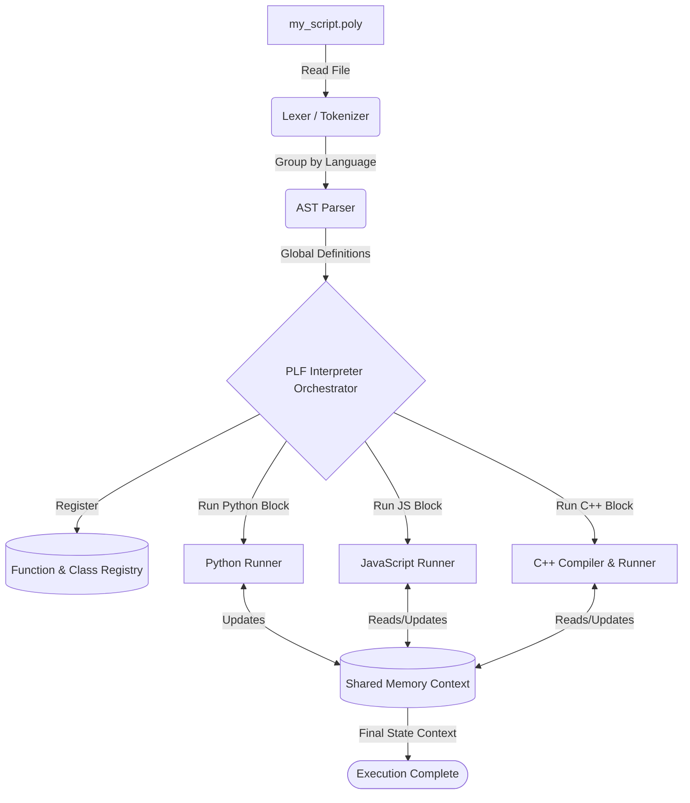
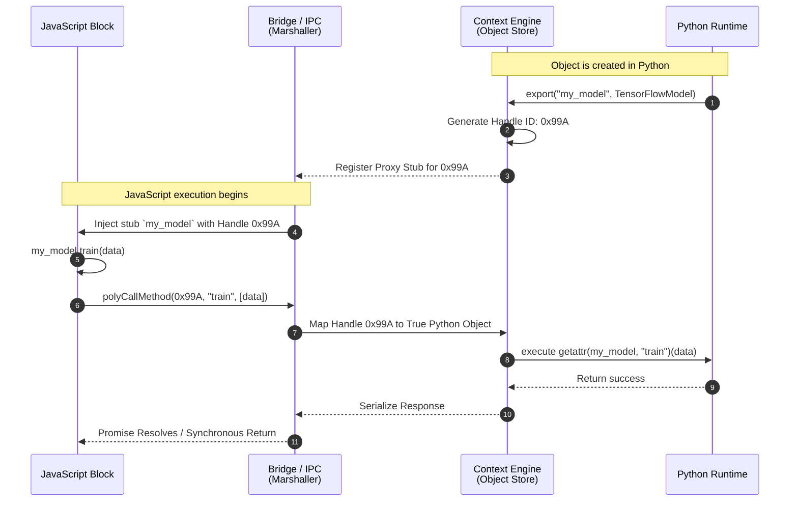

# Poly (PLF-Tool) - The Ultimate Polyglot Framework

Welcome to the **Poly Language Framework (PLF)** — a revolutionary paradigm in software engineering. PLF breaks down language barriers, allowing you to execute Python, JavaScript, C++, Java, and C seamlessly in a single source file (`.poly`).

This framework doesn't just run them side-by-side; it provides **transparent data bindings, shared memory bridging, recursive stub routing, and global Object-Oriented proxying**. This means variables, functions, and deeply-nested classes traverse across all language boundaries effortlessly.

---

## 📖 Table of Contents
1. [What Is This Project? (The "Why")](#what-is-this-project-the-why)
2. [What We Made: Core Features](#what-we-made-core-features)
3. [How We Made It: The Architecture](#how-we-made-it-the-architecture)
4. [Architectural Diagrams (For Beginners)](#architectural-diagrams-for-beginners)
5. [Syntax and Usage](#syntax-and-usage)
6. [Supported Languages & Type Mappings](#supported-languages--type-mappings)
7. [Running The Code](#running-the-code)

---

## 🎯 What Is This Project? (The "Why")

Modern tech stacks require different languages for different jobs: Python for Machine Learning, JavaScript for fast Async I/O, C++ for raw execution speed, and Java for enterprise scalability.

**The Problem:**
Connecting these normally requires setting up REST APIs, gRPC, Protocol Buffers, or Microservices. This introduces severe network latency, heavy serialization overhead, and requires writing massive amounts of boilerplate code just to pass a simple piece of data from one language to another.

**Our Solution:**
PLF solves this instantly. By using a single `.poly` file, developers can seamlessly pass a Python list to a JavaScript array, run an algorithm in C++, and print it in Java—all with zero network requests and completely shared context.

---

## ✨ What We Made: Core Features

To make this possible, we engineered a completely custom runtime orchestrator packed with advanced compiler-level features:

1. **Single-File Execution Context:** Define multiple language blocks (`python { ... }`, `javascript { ... }`) in one script.
2. **Universal JNI Bridge Architecture:** A powerful bridging system for languages like Java and C++ to hook natively into our Python-driven orchestrator.
3. **Bidirectional IPC (Inter-Process Communication):** Language blocks run in their native environments but communicate effortlessly over a high-speed IPC bridge.
4. **Global Abstract Classes & OOP Mapping:** Define a `class` once in a `global` block, and the PLF engine auto-generates the exact equivalent schema for Python (`class`), JavaScript (`class ES6`), Java (`public class`), and C++ (`struct/class`).
5. **Handle-Based Method Proxying:** If a Java object is instantiated, JavaScript can call methods on that object. PLF uses "object handles" and recursive stub routing to forward the method call to the host language and return the result.
6. **Smart Marshalling Engine:** Automatically translates primitive and nested types between boundaries (e.g., Python `dict` <-> C++ `std::map`).

---

## 🛠️ How We Made It: The Architecture

PLF operates on a strictly defined **Single-Pass Synchronous Orchestration Model**. If you are reading this codebase for the first time, here is how the engine processes a file:

1. **The Lexer & Parser (`core/lexer.py`, `core/parser.py`):**
   - The engine reads the text inside the `.poly` file. Instead of building a complex grammar tree for all languages, it segments the code by language identifiers (e.g., `python { ... }`) into isolated "blocks".
2. **The Interpreter & Context Engine (`core/interpreter.py`, `core/context.py`):**
   - The heart of the program. It steps through the blocks sequentially. The `Context Engine` acts as the shared memory "brain". Variables exported from one block are placed here.
3. **The Global Scope & Registries (`core/function_registry.py`, `core/class_registry.py`):**
   - Before executing code, PLF scans the `global` blocks to find universal functions and classes. It analyzes their shapes/signatures and deposits "stub" representations of them into the Context Engine.
4. **The Language Runners (`languages/*_lang.py`):**
   - The Interpreter hands the code to the specific runner. For Python, it injects variables directly via `exec()`. For JS, it spawns Node.js and prepends a string template. For C++/Java, it dynamically generates source files containing necessary C++ `std::map` headers or Java JNI bridge code, compiles them, and runs them.
5. **The Universal Bridge (Method Proxying):**
   - During execution, if C++ calls a Python function, it invokes a local "stub" that triggers an IPC call to the Context Engine. The Context Engine pauses, runs the actual Python function, and returns the serialized result back to C++.

---

## 📊 Architectural Diagrams (For Beginners)

Here are clear, visual mappings of how the system breathes life into your code.

### 1. The Core Execution Pipeline
When you run `python poly.py my_script.poly`, this is the exact flow of data.



### 2. Method Proxying & JNI Bridging (Object Handle Flow)
How does JavaScript call a method on a Python object? Below is our "Recursive Stub Routing" and Proxy architecture.



---

## 💻 Syntax and Usage

A PLF file uses extremely readable bracket syntax. Below is a real example showing seamless data and OOP passing.

```poly
global {
    # Define a pure architectural blueprint that all languages will understand
    class User {
        string username
        int age
    }

    python {
        def global_math_add(a, b):
            return a + b
    }
}

python {
    print("Python setup begins...")
    # Instantiate the global class directly!
    admin = User(username="admin_sireesh", age=30)
    export("admin_user", admin)
    
    dataset = [1, 2, 3, 4]
    export("nums", dataset)
}

javascript {
    // JavaScript natively receives the Context
    console.log("Hello from NodeJS!");
    console.log("Admin name is: ", admin_user.username);
    
    // Call the global python function seamlessly!
    let total = global_math_add(nums[0], nums[3]);
    console.log("JS called Python function to get:", total);
}
```

---

## 🔄 Supported Languages & Type Mappings

When the Marshalling Engine bridges variables, it automatically converts native types without manual parsing required by the developer.

| PLF Global / Python | JavaScript | C++ | Java |
|:---:|:---:|:---:|:---:|
| `list` | `Array` | `std::vector<T>` | `ArrayList<T>` |
| `dict` | `Object` | `std::map<K,V>` | `HashMap<K,V>` |
| `str` | `String` | `std::string` | `String` |
| `int`, `float` | `Number` | `int`, `float`| `Integer`, `Float` |
| `bool` | `Boolean` | `bool` | `Boolean` |
| **Global `class`** | **ES6 `class`**| **Compiled `class`** | **POJO `public class`** |

---

## 🚀 Running The Code

There are no complicated configurations. Just write the `.poly` file and run it.

```bash
# Execute using Python directly
python poly.py examples/my_script.poly

# Or use the convenience batch script on Windows
poly.bat examples/my_script.poly
```

**Prerequisites:**
Ensure your machine's environment variables (`$PATH` / `%PATH%`) have bindings to:
- `python` (Core Orchestrator)
- `node` (JavaScript Engine execution)
- `g++` (C/C++ compiler)
- `javac` and `java` (JVM execution)

---

### *Authored & Maintained inside the Poly_Env workspace. Breaking language boundaries at compile-time.*
